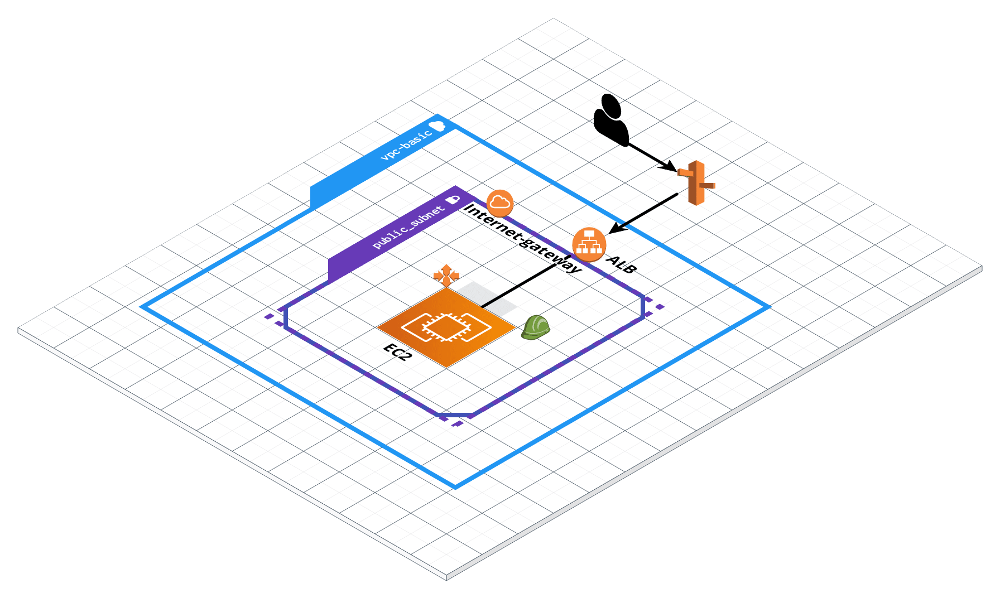

# Building aws platform


## structure
```
└── terraform
    ├── README.md
    ├── main.tf
    ├── modules
    │   ├── cloudwatch-alarm
    │   ├── cloudwatch-log-group
    │   ├── codedeploy
    │   ├── codepipeline
    │   ├── ec2-instance
    │   ├── iam-role
    │   ├── lambda
    │   ├── route53-hostedzone
    │   ├── route53-record
    │   ├── s3
    │   ├── security-group
    │   ├── sns
    │   ├── sqs
    │   └── vpc-network
    │       ├── gateway.tf
    │       ├── private_subnet.tf
    │       ├── public_subnet.tf
    │       ├── variables.tf
    │       └── vpc.tf
    ├── outputs.tf
    ├── terraform.tfstate
    ├── terraform.tfstate.backup
    └── variables.tf
```
## How to deploy specical module
```
terraform apply -target=aws_instance.ec2_example 
```

